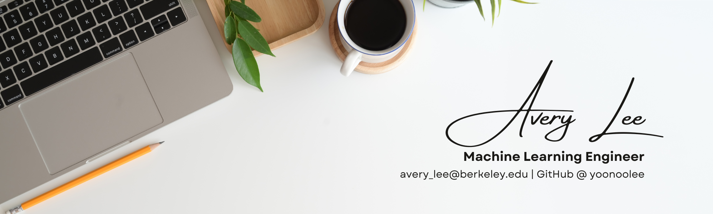

## Hi there 👋🏻 

I'm Avery. Machine Learning Engineer with interests in machine learning models, data modelling, and data visualization. 

I'm currently pursuing a Master of Information Management and Systems @ UC Berkeley iSchool, specializing in Data Science and Machine Learning. 

* Create machine learning models using Python.
* Extract meaningful insights and patterns from complex data. 
* Query and analyze data using SQL.
  
### 📚 Projects

Welcome to my portfolio! Check out my recent projects [here](https://github.com/yoonoolee/portfolio).

### ️🛠️ Tools

* Languages: Python, SQL, R, Java, MATLAB, C++ 
* Databases: Snowflake, MySQL, IBM DB2, Sybase IQ
* Tools & Frameworks: Jupyter, VS Code, Google Colab, PyCharm, IntelliJ, Anaconda, Git (GitHub/GitLab), LaTeX

### 💬 Connect 

* [Linkedin](https://www.linkedin.com/in/averyaverylee/)
* Email: avery_lee@berkeley.edu | yoonoolee@gmail.com

